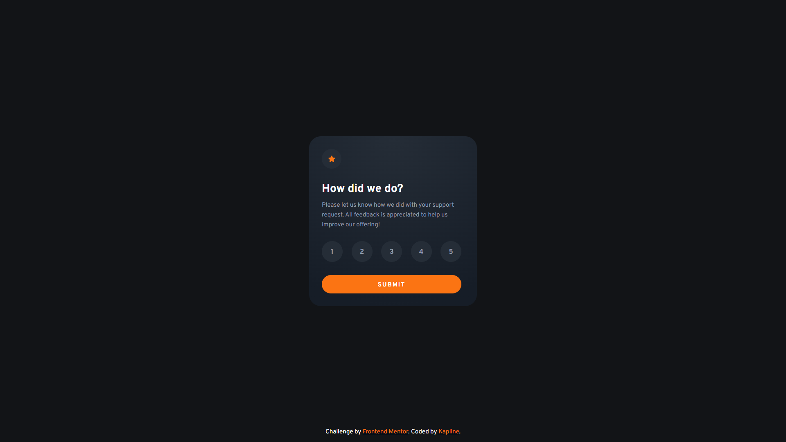

# Frontend Mentor - Interactive rating component solution

This is a solution to the [Interactive rating component challenge on Frontend Mentor](https://www.frontendmentor.io/challenges/interactive-rating-component-koxpeBUmI). Frontend Mentor challenges help you improve your coding skills by building realistic projects. 

## Table of contents

- [Overview](#overview)
  - [The challenge](#the-challenge)
  - [Screenshot](#screenshot)
  - [Links](#links)
- [My process](#my-process)
  - [Built with](#built-with)
  - [What I learned](#what-i-learned)
  - [Useful resources](#useful-resources)
- [Author](#author)

## Overview

### The challenge

Users should be able to:

- View the optimal layout for the app depending on their device's screen size
- See hover states for all interactive elements on the page
- Select and submit a number rating
- See the "Thank you" card state after submitting a rating

### Screenshot

### Links

- [Solution URL](https://www.frontendmentor.io/solutions/responsive-interactive-rating-component-AAZjN_zCkM)
- [Live site URL](https://astonishing-zuccutto-a493d8.netlify.app/)

## My process

### Built with

- Semantic HTML5 markup
- CSS custom properties
- Flexbox
- Pure JavaScript
- GitHub Pages

### What I learned

First time ever used JS in this site. It was pretty easy with manual that I used. From my perspective my code looks pretty good, but I'm sure that I have something to improve. Maybe. I need feedback about it.

### Useful resources

- [JavaScript.info](https://javascript.info/) - I've learnt everything about JS from this site

## Author

- Frontend Mentor - [@TrueKapline](https://www.frontendmentor.io/profile/TrueKapline)
